# EPAM-DevOps22: Linux Networking
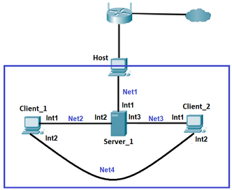

### Networks:
+ Net1 - 192.168.0.0/24
+ Net2 - 10.91.15.0/24
+ Net3 - 10.15.91.0/24
+ Net4 - 172.16.15.0/24
### Used VM machines and interfaces
- Server-1 - UbuntuServer-22.04

| Interfaces | IP addresses | MAC addresses |
| ------------- | ------------- | ----------|
| enp0s3 | 192.168.0.200/24 | 08:00:27:01:4c:ad |
| enp0s8 | 10.91.15.200/24 | 08:00:27:1b:35:1a |
| enp0s9 | 10.15.91.200/24 | 08:00:27:8b:31:0c |

- Client-3 - Ubuntu-22.04

| Interfaces | IP addresses | MAC addresses |
| ------------- | ------------- | ----------|
| enp0s3 | dynamic | 08:00:27:43:c7:d7 |
| enp0s8 | 172.16.15.15/24 | 08:00:27:ec:16:e8 |

- Client-2 - Centos-7

| Interfaces | IP addresses | MAC addresses |
| ------------- | ------------- | ----------|
| enp0s3 |dynamic | 08:00:27:4a:42:5d |
| enp0s8 | 172.16.15.16/24 | 08:00:27:b2:e8:d2 |

## Steps of Task
**1. СONFIGURATION OF NETWORK SETTINGS ON VIRTUAL MACHINES.**

1.1 Start the first VM machine with DHCP Server. Enter network settings according to the task. Open the network plan configuration file and add settings:</br>

__/etc/netplan/*yaml__</br>

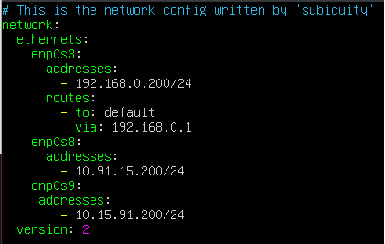

1.2  Apply the settings using the following command:
```
 sudo netplan apply
```
1.3 Сonfiguring the DHCP server on Server-1 to issue network addresses for new clients in next files:</br>

__/etc/dhcp/dhcpd.conf__</br>

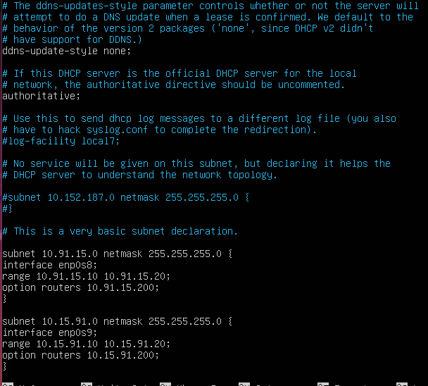

__/etc/default/isc-dhcp-server__</br>


1.4 Checking the operation of the DHCP service:

```
 sudo systemctl status isc-dhcp-server.service
```
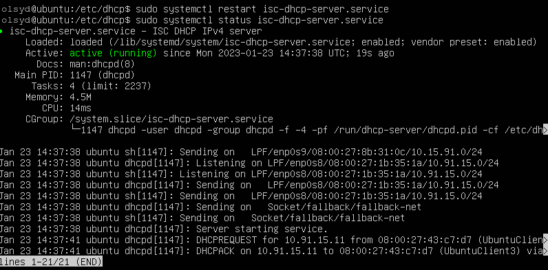

1.5 Сonfigure the operation of network ports for Client-3 and Client-2. One port works on the principle of getting a dynamic address, and the second port sets statics, according to the task:</br>

__Client-3__</br>
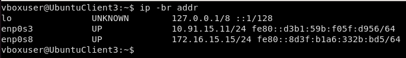</br>

__Client-2__</br>
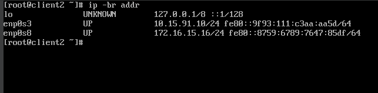

1.6 Сheking the connection between computers using the `ping` and `traceroute` command:

__Server-1__</br>
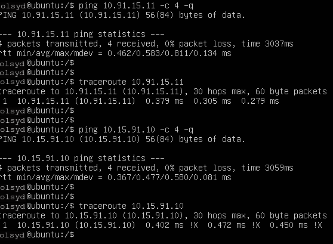

__Client-3__</br>
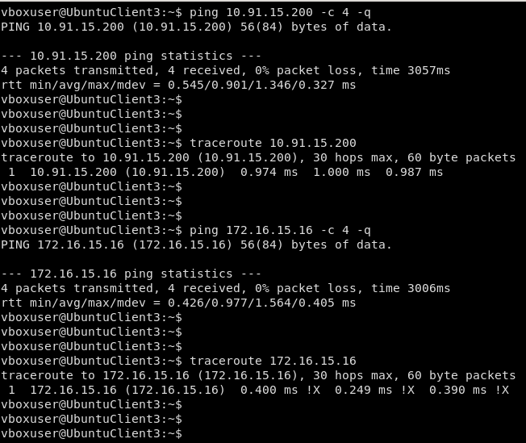

__Client-2__</br>
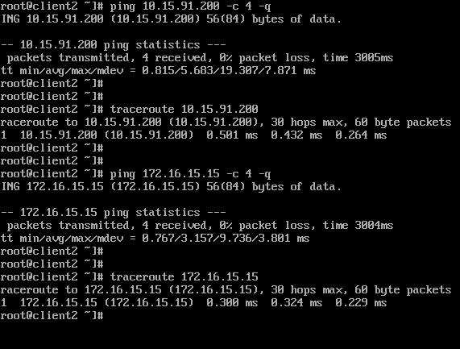

**2. CONFIGURING NETWORK TRAFFIC ON A CLIENT VIRTUAL PORT.** </br>

2.1 Add two virtual IP addresses **172.17.D+10.1/24** and **172.17.D+20.1/24** to the lo interface on Client-3. After that, we configure the routing of Client-2 along the following route:

| Host |  Via |IP addresses recipient| MAC addresses | Gateway |
| ---------| ------------- | ----------| ----------| ----------| 
| Client-2 |  Server-1|172.17.25.0 | 255.255.255.0 | 10.91.15.11 |
| Client-2 | Net4 | 172.17.35.0 | 255.255.255.0 |  172.16.15.15 |

2.2 Add two addresses to lo interface on Client-3.</br>

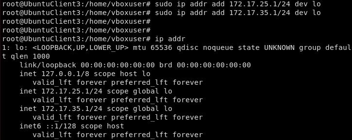

2.3 Add route from Client-2 to Server-1:</br>

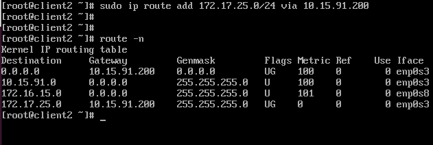

2.4 Add route from Server-1 to Client-3:</br>

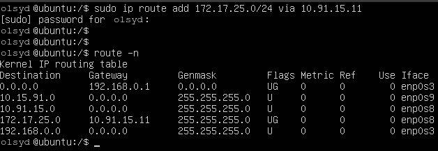 

2.5 Check the connection between Client-2 and Client-3`s virtual port:</br>

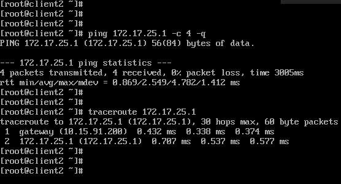

2.6 Add a route between Client-3 and Client-2 via the Net4 network and checking connections:</br>

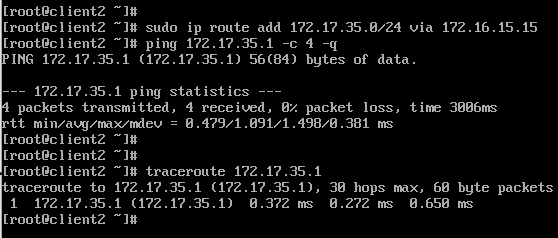

**3. CONFIGURE THE USE OF A SUMMARY VIRTUAL NETWORK.**

3.1 Use networks 172.17.25.0/24 and 172.17.35.0/24 configure routing for summarized network via Server-1:


3.2 Replace old IP addresses in lo interface Client-3:


3.3 Add a new route from Client-2 to Server-1:

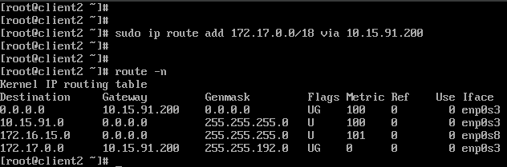

3.4 Adding a new route from Server-1 to Client-3:</br>

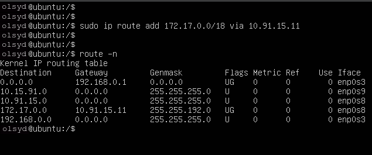

3.5 Сhecking ping and traceroute from Client-2 to 172.17.0.0/18 network:

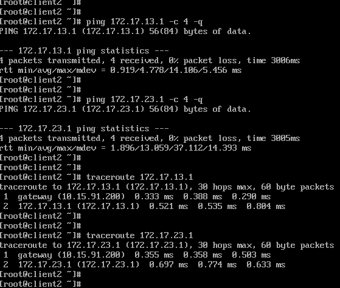

**4. SETTING UP AN SSH CONNECTION.**

4.1 Create a new ssh-key by command `ssh-keygen` on each VM and copying public keys using the next command:
```
ssh-copy-id username@remote_host
```

4.2 Checking connection via `ssh` from Client-3 to Server-1 and Client-2:</br>

.png)

.png)

4.3 Checking connection via `ssh` from Client-2 to Client-3:</br>

.png)

**5. SETTING FIREWALL**

5.1 Configuration `iptables` on Server-1:

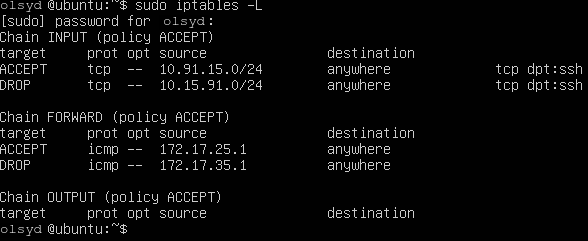

5.2 Checking ssh connection:

.png)

.png)

5.3 Checking ping connections:

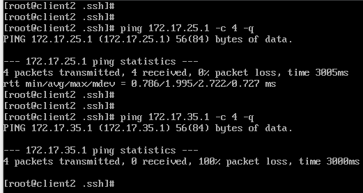

*End task*
